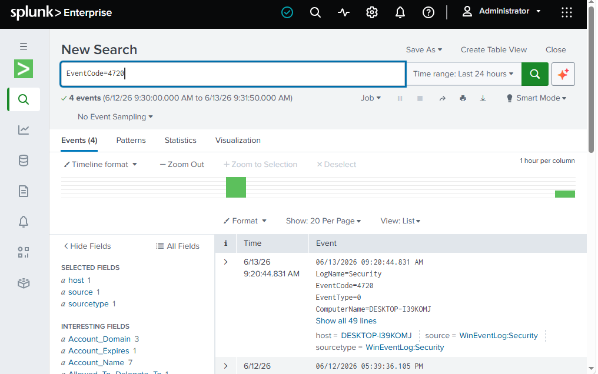
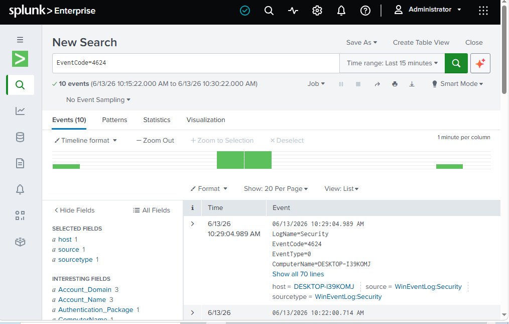
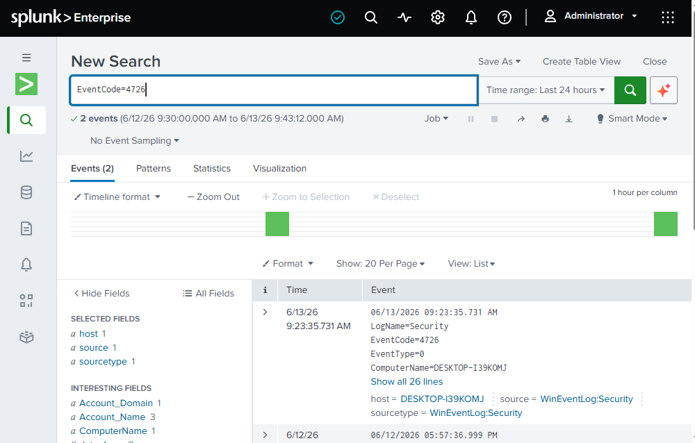
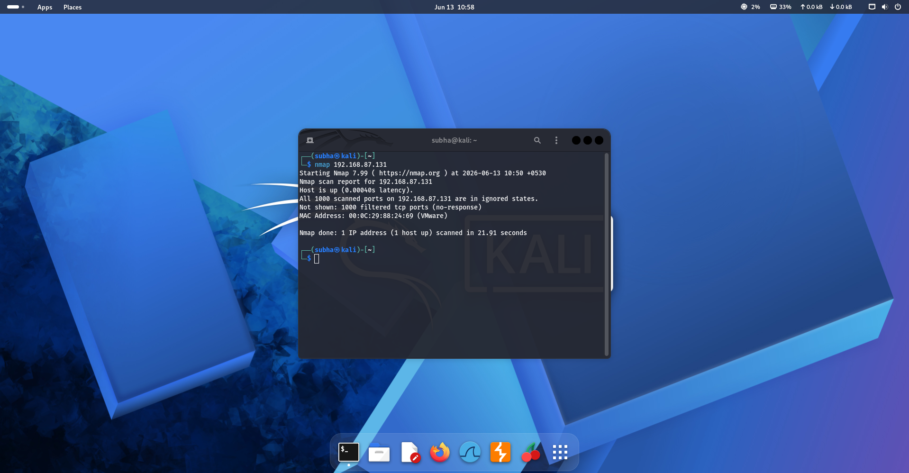

# Home SOC Lab using Splunk

## Overview

This project demonstrates the design and implementation of a Home Security Operations Center (SOC) Lab using Splunk Enterprise, Windows Event Logs, Kali Linux, and VMware Workstation. The objective was to gain hands-on experience in Security Information and Event Management (SIEM), threat detection, log analysis, incident monitoring, and MITRE ATT&CK mapping.

The lab environment was configured to collect and analyze Windows Security Events, create custom detection rules, simulate attacker activity, and investigate security-relevant events through Splunk.

---

## Objectives

- Deploy and configure Splunk Enterprise.
- Ingest Windows Event Logs for centralized monitoring.
- Create custom detection rules using Splunk Processing Language (SPL).
- Simulate attacker activity using Kali Linux.
- Investigate security events and document findings.
- Map detections to the MITRE ATT&CK framework.

---

## Lab Environment

### Infrastructure

| Component | Description |
|------------|------------|
| VMware Workstation | Virtualization Platform |
| Windows 10 VM | Target System |
| Kali Linux VM | Attack Simulation Machine |
| Splunk Enterprise | SIEM Platform |
| Sysmon | Endpoint Monitoring Tool |
| Windows Event Logs | Log Source |

---

## Network Architecture

```text
+----------------+
| Kali Linux VM  |
| (Attacker)     |
+--------+-------+
         |
         |
         v
+----------------+
| Windows 10 VM  |
| (Target)       |
+--------+-------+
         |
         |
         v
+----------------+
| Splunk SIEM    |
| Event Analysis |
+----------------+
```

---

## Log Sources

The following Windows Event Logs were ingested into Splunk:

- Security Logs
- System Logs
- Application Logs

---

# Detection Rules

## 1. Multiple Failed Login Attempts

### Objective

Detect possible brute-force login attempts against local user accounts.

### SPL Query

```spl
source="WinEventLog:Security" EventCode=4625
| stats count by Account_Name, Source_Network_Address
| where count > 3
```

### Event ID

```text
4625
```

### MITRE ATT&CK

```text
T1110 - Brute Force
```

### Findings

Multiple failed authentication attempts were observed against local accounts, indicating possible password-guessing or brute-force activity.

---

## 2. User Account Creation Detection

### Objective

Detect creation of new user accounts on the endpoint.

### SPL Query

```spl
EventCode=4720
```

### Event ID

```text
4720
```

### MITRE ATT&CK

```text
T1136 - Create Account
```

### Findings

A new local user account was successfully created and logged by Windows Security Events.

---

## 3. User Account Deletion Detection

### Objective

Detect deletion of user accounts.

### SPL Query

```spl
EventCode=4726
```

### Event ID

```text
4726
```

### MITRE ATT&CK

```text
T1531 - Account Access Removal
```

### Findings

Deletion of local user accounts was successfully detected and monitored.

---

## 4. Successful Login Detection

### Objective

Monitor successful user authentication events.

### SPL Query

```spl
EventCode=4624
```

### Event ID

```text
4624
```

### MITRE ATT&CK

```text
T1078 - Valid Accounts
```

### Findings

Successful logon events were collected and analyzed to establish user activity baselines.

---

## 5. Network Reconnaissance Simulation

### Objective

Simulate attacker reconnaissance activity from Kali Linux.

### Attack Command

```bash
nmap 192.168.87.131
```

### Result

```text
Host is up.
All 1000 scanned ports filtered.
```

### MITRE ATT&CK

```text
T1046 - Network Service Discovery
```

### Findings

The Windows host responded to network probes while filtering inbound TCP connections through firewall controls. This demonstrated basic reconnaissance activity and defensive filtering.

---

# Screenshots

## Failed Login Detection



---

## Account Creation Detection


---

## Successful Login Detection



---

## Account Deletion Detection



---

## Nmap Reconnaissance



---

# MITRE ATT&CK Mapping

| Detection | MITRE Technique |
|------------|----------------|
| Failed Login Attempts | T1110 |
| Successful Login | T1078 |
| User Account Creation | T1136 |
| User Account Deletion | T1531 |
| Network Reconnaissance | T1046 |

---

# Key Skills Demonstrated

- Security Information and Event Management (SIEM)
- Splunk Enterprise Administration
- Windows Event Log Analysis
- Detection Engineering
- Security Monitoring
- Incident Investigation
- Threat Hunting
- MITRE ATT&CK Mapping
- Security Event Correlation
- Network Reconnaissance Analysis
- Log Management
- Virtual Lab Deployment

---

# Lessons Learned

- Configured and managed a Splunk SIEM environment.
- Created custom SPL-based detection rules.
- Investigated authentication-related security events.
- Performed attack simulation using Kali Linux.
- Mapped detections to MITRE ATT&CK techniques.
- Gained practical SOC Analyst and Blue Team experience.

---

# Future Enhancements

- Integrate Sysmon process monitoring.
- Deploy Wazuh for advanced endpoint visibility.
- Integrate Suricata IDS for network detection.
- Build custom Splunk dashboards.
- Automate alerting and incident response workflows.
- Expand the lab with Active Directory and centralized logging.

---

## Author

**Subha Shree A**

Cybersecurity Engineering Student | CompTIA Security+ | ISC2 CC | AWS Cloud Practitioner
